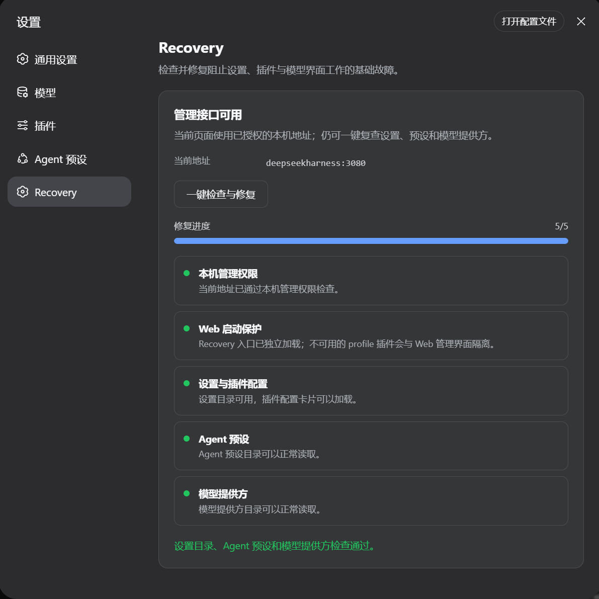

# Recovery

[中文](README.md)

Recovery is a first-aid plugin for the DSH Web interface.

When an optional plugin is deleted, damaged, or fails during startup, Recovery quarantines it for that run so DSH Web and healthy features can still start. Open **Settings → Recovery** and select **Check and repair** to see the exact problem and repair progress.

## What it handles

- A plugin file was deleted while its configuration remains.
- A plugin throws during startup and blocks Web.
- Plugin inventory, Agent presets, or model providers fail to load.
- A local Web address fails the Host/Origin trust check with HTTP 403.
- The Web profile is damaged and a last-known-good copy exists.

Recovery backs up the current profile, attempts safe restoration, retries the checks, and rolls files back when repair fails. The bad plugin remains quarantined so healthy features can continue working.

## Use

1. Download the Recovery package from **Releases**.
2. Install it into the DSH `web` Profile using DSH's GitHub plugin installation flow.
3. Restart DSH Web.
4. Open **Settings → Recovery → Check and repair**.

Checks and repairs run locally and do not call a model API. Reinstalling an npm or GitHub package may require network access.

## Requirement

Recovery requires a DSH version with bad-plugin startup quarantine support. That protection runs before ordinary plugins load; an older DSH launcher cannot recover a completely failed Web startup from a newly installed plugin alone.

## License

MIT
